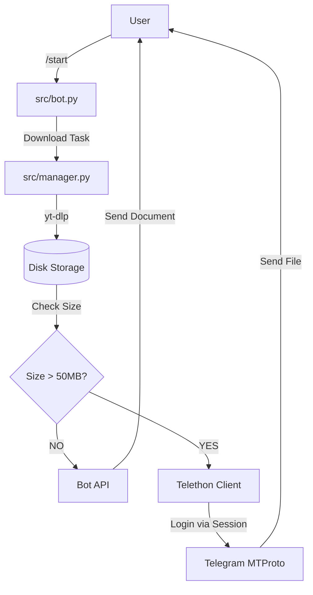

# Architecture Documentation: TubeGo

## 1. Overview
TubeGo is a cross-platform application built on **Python**. Its main feature is the ability to run in four different modes sharing the same logical core:
1.  **CLI:** Automation script.
2.  **Desktop GUI:** Desktop app (Windows/Linux/macOS).
3.  **Mobile App:** Native Android application (APK).
4.  **Telegram Bot:** Remote management server (Bot + Userbot).

## 2. Key Technologies

| Component | Technology | Function |
|------------|------------|---------|
| **Language** | Python 3.10+ | Business logic. |
| **UI Framework** | Flet | Reactive UI and mobile compilation. |
| **Download Engine** | yt-dlp | Video/audio stream extraction. |
| **Bot Framework** | python-telegram-bot | Bot API (Commands, Menus). |
| **Userbot** | Telethon | Large file uploads (>50MB). |

## 3. Telegram Bot Architecture (Hybrid)

The bot operates in a hybrid mode to bypass Telegram's API limits.



### 3.1. Internationalization (i18n)
The bot includes a dictionary-based translation system (`en` / `es`).
- **Auto-detect:** Checks user's Telegram language settings.
- **Manual:** `/language` command.

### 3.2. State Management
- **`src/manager.py`**: Handles concurrent downloads and tracks file states (downloaded, uploaded, failed).
- **`FILE_CACHE`**: Temporary indexing for file management buttons.

## 4. Folder Structure

The project follows a modular structure to separate logic, data, and documentation.

```
/
├── src/                # Source code
│   ├── bot.py          # Telegram Bot Entry Point
│   ├── core.py         # Downloader Logic
│   └── manager.py      # State Manager
├── docs/               # Documentation
│   ├── ARCHITECTURE.md
│   ├── GEMINI.md
│   └── telegram_bot.md
├── data/               # Sensitive Data (GitIgnored)
│   └── user_session.session # Telethon Session
├── logs/               # Execution Logs (GitIgnored)
│   └── bot.log
├── downloads/          # Temporary File Storage
│   └── uploaded/       # Archive of completed files
├── .env                # Secrets (GitIgnored)
├── main.py             # CLI/GUI Entry Point
└── setup_session.py    # Helper script for 2FA
```

## 5. System Components

### 5.1. Entry Point (`main.py`)
Acts as a **Dispatcher** for local usage (CLI/GUI).

### 4.2. Core Logic (`src/core.py`)
The heart of the system. Implements the `Downloader` class.
*   **Environment Detection:** Verifies `ffmpeg` availability.
*   **Format Selection:** Adapts requests based on available tools (Merge vs Single Stream).

### 4.3. Bot Server (`src/bot.py`)
A robust, asynchronous server that handles:
- Commands (`/start`, `/quality`, `/files`).
- Inline Button Callbacks.
- Thread-pooled downloads to avoid blocking the event loop.
- Automatic updates via Git (`/update`).

## 5. Build Strategy
The APK build process (`scripts/build_android.sh`) leverages Flet to bundle Python code, a lightweight interpreter, and pure Python libraries into an installable APK.
